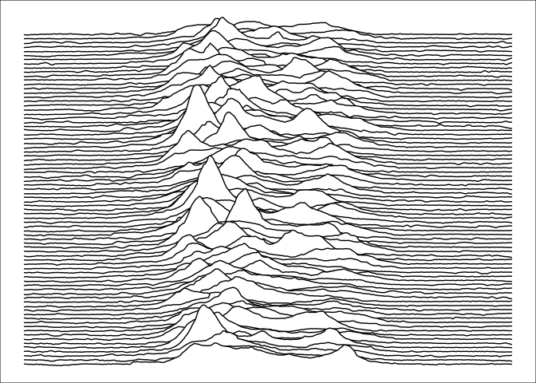

CP 1919 / PSR B1919+21 Dataset
==============================

This dataset, found in one of my old external drives, corresponds to the
famous plot from [*Radio Observations of the Pulse Profiles and
Dispersion Measures of Twelve
Pulsars*](https://www.proquest.com/docview/302499144/abstract?sourcetype=Dissertations%20&%20Theses)
(Craft, 1970). This is broadly known as the Joy Division’s plot from
[*Unknown Pleasures*](https://en.wikipedia.org/wiki/Unknown_Pleasures).
If you happen to know whom created the provided CSV file, please let me
know so I can give proper credit.

The dataset contains “successive pulses from the first pulsar
discovered, CP 1919, are here superimposed vertically. The pulses occur
every 1.337 seconds. They are caused by rapidly spinning neutron star.”
(The Cambridge Encyclopaedia of Astronomy, 1977)

Thanks to [Scientific
American](https://www.scientificamerican.com/blog/sa-visual/pop-culture-pulsar-origin-story-of-joy-division-s-unknown-pleasures-album-cover-video/),
there is a complete explanation of the dataset and its origin.

Read
----

    pulsar <- readr::read_csv("cp1919.csv")

    ## Rows: 24000 Columns: 3
    ## ── Column specification ────────────────────────────────────────────────────────
    ## Delimiter: ","
    ## dbl (3): x, y, z
    ## 
    ## ℹ Use `spec()` to retrieve the full column specification for this data.
    ## ℹ Specify the column types or set `show_col_types = FALSE` to quiet this message.

    pulsar

    ## # A tibble: 24,000 × 3
    ##        x     y     z
    ##    <dbl> <dbl> <dbl>
    ##  1     1     1 -0.81
    ##  2     2     1 -0.91
    ##  3     3     1 -1.09
    ##  4     4     1 -1   
    ##  5     5     1 -0.59
    ##  6     6     1 -0.82
    ##  7     7     1 -0.43
    ##  8     8     1 -0.68
    ##  9     9     1 -0.71
    ## 10    10     1 -0.27
    ## # ℹ 23,990 more rows

Visualize
---------

### The Cambridge Encyclopaedia of Astronomy (1977)

    library(ggplot2)
    library(ggridges)

    col1 <- "white"
    col2 <- "black"

    ggplot(pulsar, aes(x = x, y = y, height = z, group = y)) +
      geom_ridgeline(
        min_height = min(pulsar$z),
        scale = 0.2,
        linewidth = 0.5,
        fill = col1,
        colour = col2
      ) +
      scale_y_reverse() +
      theme_void() +
      theme(
        panel.background = element_rect(fill = col1),
        plot.background = element_rect(fill = col1, color = col1),
      )

### The Nature of Pulsars (Scientific American, 1970)

    col1 <- "#94cee1"
    col2 <- "white"

    ggplot(pulsar, aes(x = x, y = y, height = z, group = y)) +
      geom_ridgeline(
        min_height = min(pulsar$z),
        scale = 0.2,
        linewidth = 0.5,
        fill = col1,
        colour = col2
      ) +
      scale_y_reverse() +
      theme_void() +
      theme(
        panel.background = element_rect(fill = col1),
        plot.background = element_rect(fill = col1, color = col1),
      )

### Joy Division’s Unknown Pleasures (1979)

    col1 <- "black"
    col2 <- "white"

    ggplot(pulsar, aes(x = x, y = y, height = z, group = y)) +
      geom_ridgeline(
        min_height = min(pulsar$z),
        scale = 0.2,
        linewidth = 0.5,
        fill = col1,
        colour = col2
      ) +
      scale_y_reverse() +
      theme_void() +
      theme(
        panel.background = element_rect(fill = col1),
        plot.background = element_rect(fill = col1, color = col1),
      )

